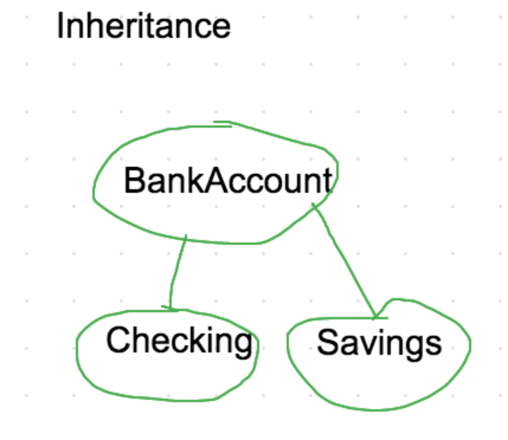
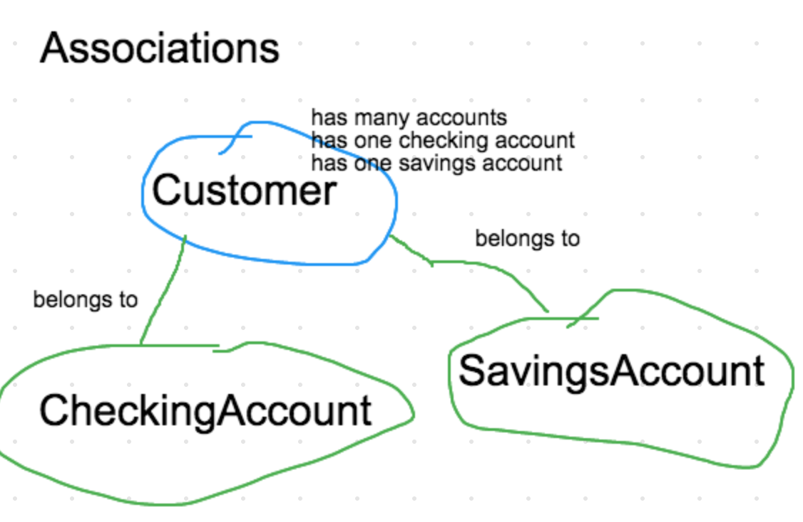

# Object Relations

---
* _Early lecture tomorrow morning_
* **Relationships**
  * Inheritance ("is a")
  * Association ("has one/has many/belongs to")
  * Composition ("is part of a")
* **Modeling**
  * Draw out models (classes)
  * Draw out attributes
  * Draw out relationships
* **Adding relationships to our BankAccount model**
  * Related models
    * Bank
    * Customer
    * Account
      * Checking Account
      * Savings Account
    * Transaction
      * Withdrawal
      * Deposit
      * Charge
      * Transfer
* **Folder structure**
  * app
    * models
      * account.rb
      * bank.rb
      * customer.rb
      * ...
  * config
    * environment.rb
  * bin
    * Run
  * Gemfile

* Relationships
  * CheckingAccount and SavingsAccount inherit from BankAccount
    * 
  * Customer has many accounts
    * 
